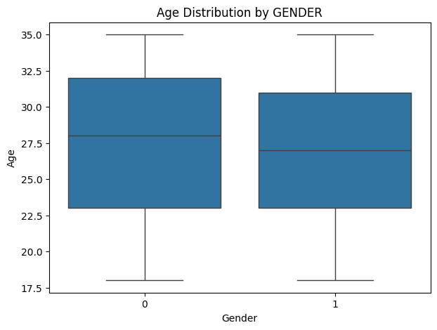
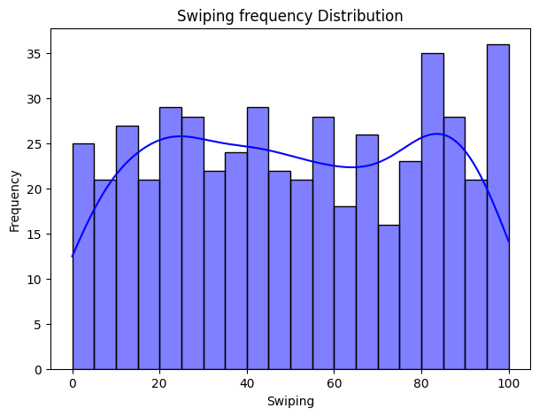

# LoveLogic (Project of Data Visualization (COM-480))

| Student's name | SCIPER |
| -------------- | ------ |
| Rania Hatrouhou| 342084|
| Leila Benjelloun| 326895|
|Yassine Chami Khazraji |326806 |

[Milestone 1](#milestone-1) • [Milestone 2](#milestone-2) • [Milestone 3](#milestone-3)

[Go to website](https://love-logic-raniahtr-ranias-projects-cea5148e.vercel.app)

## Milestone 1 (21st March, 5pm)

### Dataset

We are using a structured dataset on **dating app users**, containing **500 entries** with details on **age, gender, height, interests, relationship goals, education level, occupation, swiping history, and frequency of app usage**.   

This dataset enables an in-depth analysis of **dating behavior, interests, and swiping activity**, revealing patterns in how different user demographics engage with the platform.

---
### Problematic

Our visualization explores **behavioral patterns in dating app usage**, focusing on how different user attributes influence engagement and preferences. The **primary axes of analysis** include:  

- **User Preferences**: How do different demographics (**age, gender, education level**) impact dating preferences and expectations?  
- **Swiping Behavior**: Do users looking for a serious relationship (Marriage, Long-term Relationship) swipe more or less than those looking for casual dating or friendship? 
- **User Selectivity**: What demographic factors influence user selectivity in online dating apps?  
- **App Usage Frequency**: Do certain user profiles (e.g., younger vs. older users) exhibit **distinct engagement patterns**, such as daily vs. occasional usage?  

#### **Motivation**  
Dating apps have transformed modern relationships, yet **behavioral insights remain underexplored**. By visualizing dating trends, we aim to:  
- **Reveal factors that shape user preferences** and engagement.  
- **Identify common patterns in app interactions**, potentially improving matchmaking systems.  
- **Provide insights into online dating behaviors**, offering value for social research.  

#### **Target Audience**  
Our findings benefit:  
- **Dating app developers & UX designers**, helping optimize user experiences.  
- **Social scientists & data analysts**, studying online dating trends.  
- **Users curious about dating patterns**, who want to understand how preferences shape interactions.  

### Exploratory Data Analysis

#### 🔍 **Preprocessing & Data Insights**  
Before diving into the fun part, we cleaned and preprocessed our dataset:  
- **Converted categorical data into numerical values** (e.g., gender, education level).  
- **Extracted individual interests** (e.g., cooking, hiking, music) into binary features.  
- **Handled missing values** (only a few interest columns had them).  
- **Encoded relationship goals & usage frequency** for analysis.  

#### 📊 **The Dating App Landscape: Key Findings**  

##### 👥 **Who’s on the App?**  
- Men are, on average, older than women on dating apps.
- The **average user age is 27**, with most users between **23-30 years old**.  
- Gender is evenly distributed (**50% male, 50% female**).  

#### 🔥 **Interests & Hobbies: What’s Popular?**  
- **Travel is the most common interest** (**62.9% of users**).  
- **Music (58.5%) and sports (58.3%)** are also highly popular.  
- **Cooking (58.1%), reading (57.7%), and hiking (57.1%)** have nearly equal engagement.  
- **Movies (55.7%)** is the least common among the listed interests, but still popular.  
- Users tend to list **multiple interests**, indicating a broad range of hobbies.  

#### 📈 **Swiping Behavior: Do People Swipe A Lot?**  
- The **average user has swiped 50 times**.  
- Some users barely swipe, while others **go over 100+ swipes** per session!  
- There are **distinct engagement levels**, suggesting different usage patterns (casual vs. active users).  

### **What’s Next?**  
With these insights, we’ll explore deeper **correlations** between interests, preferences, and swiping behavior. Are **travel lovers more likely to swipe right on fellow travelers**? Does **relationship intent influence swiping patterns**?  

Stay tuned for **eye-catching visualizations** that reveal the secrets of online dating!

### Related work

#### **Existing Research**  
A **study on Tinder user behavior** in New York City and London revealed distinct gender differences in swiping strategies.  
- **Men** liked a large proportion of profiles but received matches only **0.6% of the time**.  
- **Women** were more selective and achieved a **10% match rate**.  
- **Women were also more engaged** in conversations, sending longer messages than men.  
[Source: Wikipedia - Tinder](https://en.wikipedia.org/wiki/Tinder_%28app%29)

Another **study examined swiping behaviors** on dating apps, focusing on mate value preferences and sexual satisfaction among young adults.  
- Motivations such as **seeking committed relationships or casual sex** influenced swiping behaviors.  
- Findings suggested that **need satisfaction with matches impacted long-term engagement** on dating platforms.  
[Source: ResearchGate - Swiping on Dating Apps](https://www.researchgate.net/publication/381194438_A_Multi-Method_Study_Examining_the_Role_of_Swiping_on_Dating_Apps_Mate_Value_Preferences_Sexual_Satisfaction_and_Need_Satisfaction_with_Matches_in_Emerging_Adults)

#### **Our Approach**  
While previous studies primarily focused on **match rates and messaging behaviors**, our project explores:  
- **Correlations between user demographics, interests, and app engagement patterns**  
- How **age, education level, and shared interests** influence user interactions  
- Swiping behaviors in relation to **relationship goals and common interests**  

We focus on **interactive visualizations** to uncover **behavioral trends**, rather than predictive models.

#### **Inspirations**  
We take inspiration from **FiveThirtyEight** and **FlowingData**, known for:  
- **Data-driven storytelling**  
- **Clear, engaging visualizations**  

By combining **existing research with interactive visualizations**, our project provides a **unique perspective** on dating app user behavior.

## Milestone 2 (18th April, 5pm)

**10% of the final grade**

## Milestone 3 (30th May, 5pm)

**80% of the final grade**

## Late policy

- < 24h: 80% of the grade for the milestone
- < 48h: 70% of the grade for the milestone

